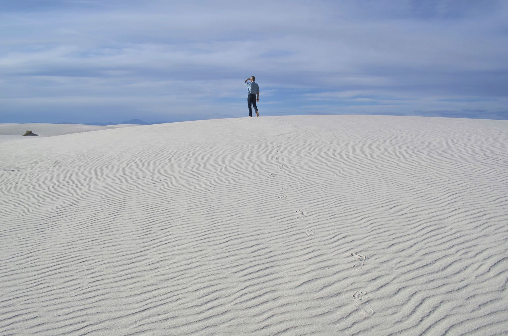

---
# Feel free to add content and custom Front Matter to this file.
# To modify the layout, see https://jekyllrb.com/docs/themes/#overriding-theme-defaults

#layout: home
layout: default
title : Jon Holtzman
id : Home
#classes : 
#  - landing
#  - dark-theme
---

 

Professor Emeritus, Department of Astronomy\
New Mexico State University\
Box 30001 / MSC 4500\
1320 Frenger Mall\
Las Cruces NM 88003\
575-646-8181 (office)

[Curriculum vitae](vitae.pdf)

I grew up in Baltimore MD, received my B.A. and M.S. at Wesleyan
University, and got my Ph.D. at the University of California, Santa Cruz.
I spent six years working as a research associate at the Lowell Observatory
in Flagstaff AZ before moving to New Mexico State University in 1995. I
formally retired in 2024, but continue to be active in several areas.

My main research interests are in stellar populations, galaxies, and
cosmology. I also enjoy working with data analysis and astronomical
instrumentation and software.

I was fortunate to have been involved with work on the Hubble
Space Telescope: I was an associate member of the Instrument Definition
Team for the original WF/PC camera, and a full member of the IDT for the
WFPC2 camera. I was closely involved with the initial work on diagnosing
the optical problem with the telescope and determining how it could be
corrected with new instruments.  I served on the Science Oversight Committee
for the WFC3 camera that was installed in the HST in 2009.

I've also been fortunate to have been involved with projects at
the [Apache Point Observatory](http://www.apo.nmsu.edu), as
Project Scientist for the ARC 3.5m telescope, and through
involvement with several [Sloan Digital Sky Survey](http://www.sdss.org) projects, most notably the Apache Point Observatory
Galactic Evolution Experiment (APOGEE); I served as the Survey Scientist
for the APOGEE-2 project of SDSS-IV and as Commissioning
Scientist for SDSS-V. I serve on the ARC Board of Governors as
one of the NMSU Board representatives.

Outside of astronomy-related things, I enjoy the outdoors and music.

