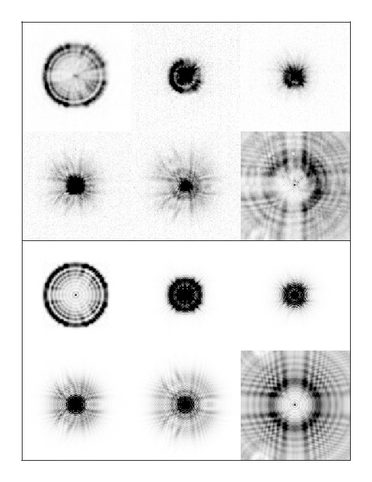
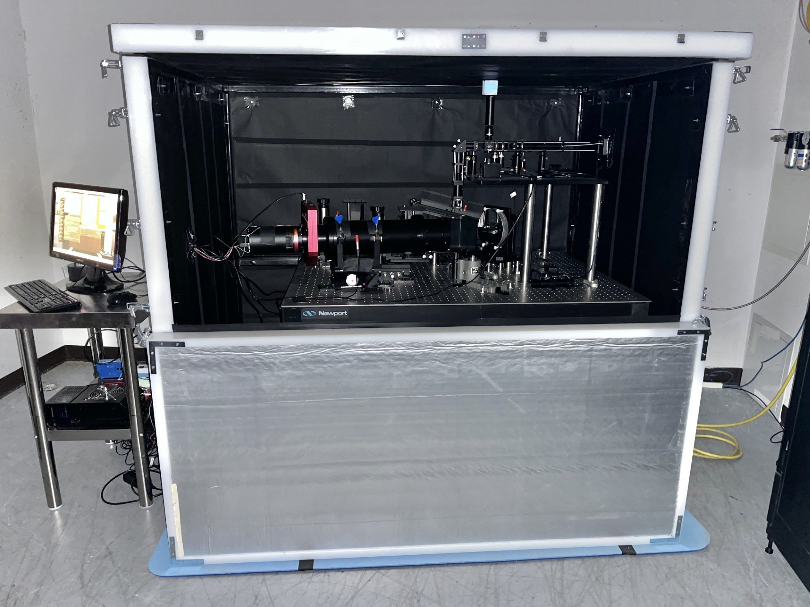

### Instrumentation

##### Hubble Space Telescope

I had originally planned to develop a dissertation using data from the Hubble Space Telescope. However, the Challenger disaster in 1987 put an 
end to those plans. Still, half of my dissertation was on developing methodology for doing stellar photometry on undersampled images. 

I moved to Lowell Observatory to work with Bill Baum and Deidre
Hunter as part of the WF/PC Instrument Definition Team. I spend a
lot of time at Goddard after the launch of HST in 1990, and was
deeply involved in the diagnosis of the optical spherical aberration
present in the telescope, as well as with its correction in the
Wide Field Planetary Camera 2.

{: style="float: left ; width: 30% ; padding: 15px"}
The top panel is a montage of images taken with the WF/PC on the
HST shortly after launch in 1990 at a wide range of positions of
the HST secondary mirror that provided a coarse focus run. The
bottom panel is a set of simulated images for the HST pupil function
with a half-wave of spherical aberration. These were the images
shown to HST/NASA management that firmly convinced everybody that
there was an optical issue with the as-built telescope. Despite the
disappointment at the time, working with Sandy Faber and the WF/PC
team in our offices at Bowie State Univerisity, generating pages
and pages of simulated images which we compared with observed images
to diagnose the issue, was a tremendous experience that has stuck
with me to the current day. And, of course, the HST story has a
happy ending!

        

##### Tortugas Mt. Observatory

<H2> Tortugas Mt Observatory </H2>

The Tortugas Mt. Observatory is located just east of Las Cruces, and
houses a 24-inch Boller and Chivens telescope (for some more information on
B&C telescopes, see [bollerandchivens.com](http://bollerandchivens.com
The telescope was built
in the late 1960's and used extensively up until the early 90's, mostly
for planetary monitoring. After that time, the telescope fell into 
disuse, perhaps because the NMSU Department of Astronomy started to
operate the Apache Point Observatory, which is home to a set of significantly
larger telescopes.

Starting in 2010, NMSU entered into a MOU with the 
[American Association of Variable Star Observers](http://www.aavso.org) to get the telescope
back into operation again. This involved significant technical upgrades
to the telescope, but the process went well.

Since the renovation, the telescope has been used for remote open houses,
observing for undergraduate classes, and by the [Summer Science Program](http://www.ssp.org)
since they started an astronomy program at NMSU in 2023.

[NMSU article about the telescope renovation](tortugasmountainobservat.html)

[Video of NMSU Engineering staff and students about the renovation project]("http://Renovation video.mp4")

[NMSU Tortugas Mt. 24"](http://astronomy.nmsu.edu/tmo-wiki) 

##### SONG at Apache Point Observatory

{: style="float: right ; width: 50% ; padding: 15px"}
NMSU was funded by the National Science Foundation to build a [SONG node at APO](astronomy.nmsu.edu/song-wiki). We purchased a Planewave 1m telescope and constructed a high resolution, fiber-fed spectrograph based off an existing design. I have developed a full suite of software to allow robotic operation of the facility and coordination with the SONG network.

[SONG](https://phys.au.dk/song/) is an international project led by Aarhus University in Denmark to study stars, predominantly through the 
measurment of stellar osciallations via spectroscopy. Given the low amplitude of oscillation signatures, observations over a long period of 
time are required, and minimizing aliasing from daily observing windows is important. As a result, the SONG project is trying to establish a
world-wide network to enable quasi-continuous observations. The first node was constructed in Tenerife, Spain, with a second node at Mt. Kent
in Australia. New nodes are under construction in New Mexico (near operational status!)  and in China.

        

##### Apache Point Observatory

[Apache Point Observatory (APO)](http://www.apo.nmsu.edu). NMSU has a 15% share of the 3.5m telescope. I have served as the Project Scientist for the 3.5m.
I helped with projects involving construction of a slit viewing camera for the (now retired) Double Imaging Spectrograph, and on getting a
replacement grating for the ARC Echelle Spectrograph. I've also developed software for reducing data from all of the 3.5m instruments, and
am working on getting reduction for these instruments implemented into PypeIt.

##### NMSU 1m

Before SONG, NMSU operated another 1m telescope at APO. I spent a large amount of time
getting this telescope to work! I had it runnning in a fully robotic mode,
with fiber feed to the SDSS APOGEE instrument; it was used for photometric
monitoring of various variable stars, supernovae followup, etc.

##### Heliostat at Sunspot Solar Observatory Visitors Center

A fun project since retirement has been to get the heliostat located outside the Visitor's Center functional again. This feeds a display inside that projects an image of the Sun on a physical screen, and also makes a visual image of the solar spectrum that visitors can explore by moving to see different parts of the spectrum .... including a lot of absorption lines!
