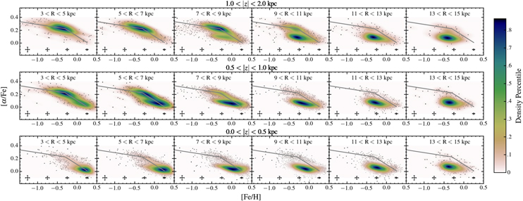
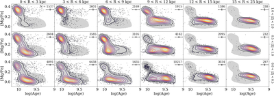
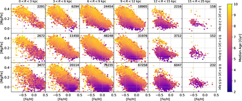
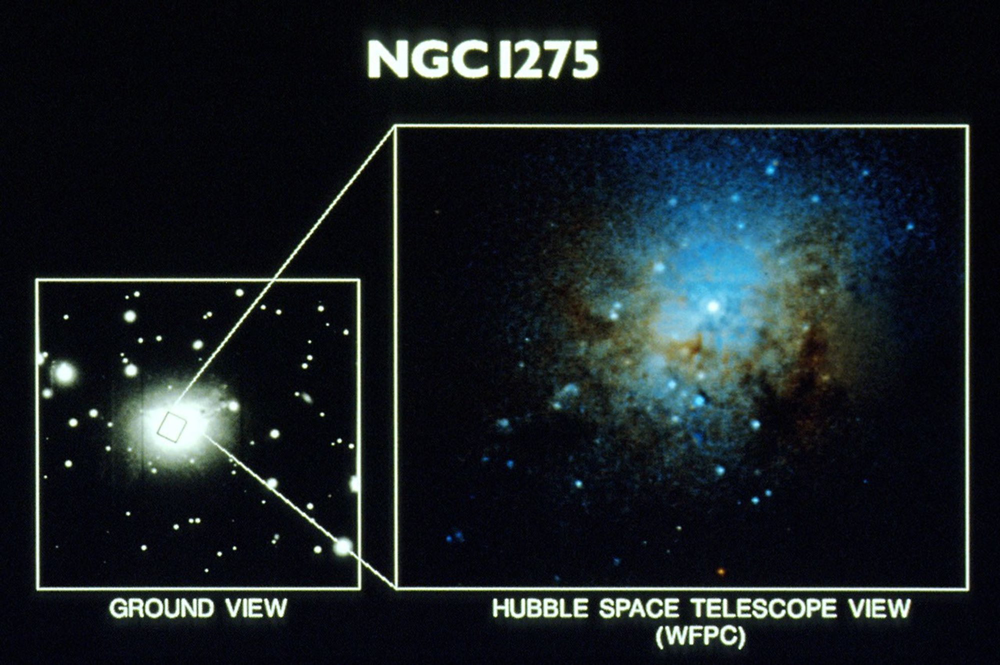

### Research

[ADS Search for refereed articles](https://ui.adsabs.harvard.edu/search/fq=%7B!type%3Daqp%20v%3D%24fq_database%7D&fq=%7B!type%3Daqp%20v%3D%24fq_property%7D&fq_database=database%3A%20astronomy&fq_property=property%3A%20refereed&q=author%3A(%22Holtzman%2C%20J%22)&sort=date%20desc%2C%20bibcode%20desc&p_=0)

### Sloan Digital Sky Survey

##### Milky Way stellar populations

{: style="float: left ; width: 30% ; padding: 15px"}

{: style="float: left ; width: 30% ; padding: 15px"}

I've been involved in several aspects of the Sloan Digital Sky Survey:
   - I was closely involved with the development of the APOGEE project, which
obtained high resolution near-IR spectra of about 600,000 Milky Way stars. I served as the Survey Scientist for the SDSS-IV portion
of APOGEE;
   - the SDSS-II supernova survey that was conducted 2005-2007; I
developed techniques for the consistent measurement of SN brightnesses
against arbiratry galaxy backgrounds using data obtained from different telescopes

### Metallicity distribution functions in Local Group dwarfs

### Stellar populations in the Local Group

One of my primary interests is
in studying stellar populations in the Local Group through photometry of
individual stars. Much of this work was done using the Hubble
Space Telescope. A large <a href="http://astronomy.nmsu.edu/logphot">
stellar photometry archive </a> been constructed from all photometry
done by the WFPC2 in the Local Group. I also worked on a project
to study the star formation history of the solar neighborhood by
incorporating detailed chemical abundance measurements.

###  External galaxies

I am interested in structural properties of galaxies,
in particular disk galaxies and the nature of bulges; I've been involved
in both photometric and spectroscopic studies. I've also studied
properties of galaxies as a function of their environment.

### Star clusters

{: style="float: left ; width: 30% ; padding: 15px"}
 A separate research interest is in the properties of
young, compact, massive star clusters. This was motivated by our initial
discovery of a population of bright blue clusters in NGC 1275 that helped
to spark the development of this field. These observations were made
with the Hubble Space Telescope WF/PC, even with its aberrated images.

[NASA article from 1992](https://science.nasa.gov/missions/hubble/nasas-hubble-space-telescope-discovers-young-star-clusters-in-giant-galaxy/)

       

### Cosmology

 For my dissertation, I did cosmological calculations using linear
perturbation theory to calculate observational predictions for large scale
structure and cosmic microwave background anisotropies. I still maintain
a strong interest in understanding the interplay between cosmology and
the formation and evolution of galaxies.

