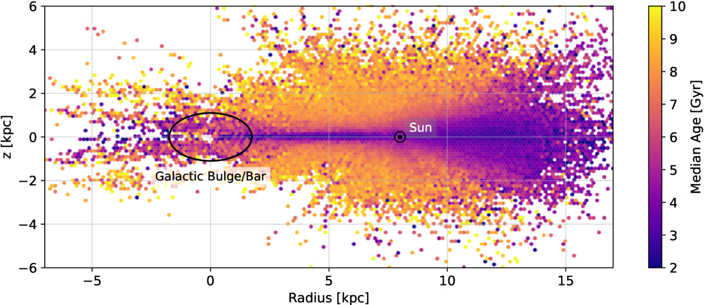
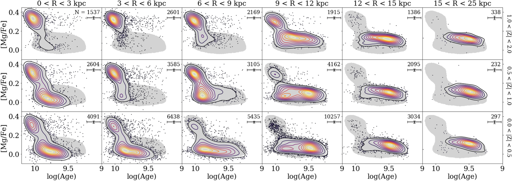

## Research

[ADS Search for refereed articles](https://ui.adsabs.harvard.edu/search/fq=%7B!type%3Daqp%20v%3D%24fq_database%7D&fq=%7B!type%3Daqp%20v%3D%24fq_property%7D&fq_database=database%3A%20astronomy&fq_property=property%3A%20refereed&q=author%3A(%22Holtzman%2C%20J%22)&sort=date%20desc%2C%20bibcode%20desc&p_=0)

### Sloan Digital Sky Survey

##### Milky Way stellar populations

[{: style="float: right ; width: 50% ; padding: 15px"}](apj515238f4_hr.jpg)
The Apache Point Observatory Galactic Evolution Experiment (APOGEE) of the Sloan Digital Sky Survey has provided dramatic new
views of Galactic stellar populations across the Milky Way, due to its ability to penetrate dust in the plane of the Galaxy using
infrared light. The moderate high resolution spectroscopy allows measurements of the abundances of multiple chemical elements.
Together, these enable **chemical cartography**.

Some of the initial results show how the so-called "alpha bimodality" varies across the disk of the Milky Way, as shown in this
pionering plot from [Hayden et al. 2015](https://ui.adsabs.harvard.edu/abs/2015ApJ...808..132H/abstract)

[{: style="float: left ; width: 50% ; padding: 15px"} ](ajaddd18f10_hr.jpg)
Subsequent work at NMSU has focussed on deriving ages of red giant stars observed with APOGEE. This is enabled by the ability of
APOGEE to measure carbon and nitrogen abundances; the C/N ratio varies with stellar mass due to variations in mixing and the amount 
of CNO burning, and masses of red giants directly imply ages. The figure to the left is a 
map of mean ages across the Milky Way from [Stone-Martinez et al. 2025]()

Subsequent work at NMSU has focussed on deriving ages of red giant stars observed with APOGEE. This is enabled by the ability of
APOGEE to measure carbon and nitrogen abundances; the C/N ratio varies with stellar mass due to variations in mixing and the amount 
of CNO burning, and masses of red giants directly imply ages.

Maps of the [alpha/Fe] vs [Fe/H] relation encoded by stellar age from [Stone-Martinez et al 2025]() and 
[Imig et al 2023](https://ui.adsabs.harvard.edu/abs/2023ApJ...954..124I/abstract):
[{: style="float: left ; width: 40% ; padding: 15px"}](apjace9b8f25_hr.jpg)
[{: style="float: right ; width: 40% ; padding: 15px"}](ajaddd18f13_hr.jpg)

       

##### Other SDSS projects

I've been involved in several aspects of the Sloan Digital Sky Survey:

   - I was closely involved with the development of reduction and analysis software for the APOGEE project, which
obtained high resolution near-IR spectra of about 600,000 Milky Way stars. I served as the Survey Scientist for the SDSS-IV portion
of APOGEE. A description of much of the analysis techniques used can be found in the [SDSS DR17 data release paper](https://ui.adsabs.harvard.edu/abs/2022ApJS..259...35A/abstract), [Jonsson et al. (2020)](https://ui.adsabs.harvard.edu/abs/2020AJ....160..120J/abstract) and 
[Holtzman et al (2018)](https://ui.adsabs.harvard.edu/abs/2018AJ....156..125H/abstract)

   - the SDSS-II supernova survey that was conducted 2005-2007; I
developed techniques for the consistent measurement of SN brightnesses
against arbiratry galaxy backgrounds using data obtained from different telescopes
([Holtzman et al. (2008)](https://ui.adsabs.harvard.edu/abs/2008AJ....136.2306H/abstract)

### Stellar populations in the Local Group

##### Star formation histories of Local Group galaxies

One of my primary interests is in studying stellar populations in
the Local Group through photometry of individual stars. Much of
this work was done using the Hubble Space Telescope. A large <a
href="http://astronomy.nmsu.edu/logphot"> stellar photometry archive </a>
was constructed from all photometry done by the WFPC2 in the
Local Group [(Holtzman, Afonso, & Dolphin 2006)](https://ui.adsabs.harvard.edu/abs/2006ApJS..166..534H/abstract).
[Weisz et al. (2014)](https://ui.adsabs.harvard.edu/abs/2014ApJ...789..147W/abstract)
(also [Weisz et al (2014b)](https://ui.adsabs.harvard.edu/abs/2014ApJ...789..148W/abstract) and
[Weisz et al (2014c)](https://ui.adsabs.harvard.edu/abs/2014ApJ...789..148W/abstract)]
used this to derive star formation histories of Local Group galaxies.

##### Metallicity distribution functions in Local Group dwarfs

[Ross et al (2015)](https://ui.adsabs.harvard.edu/abs/2015AJ....149..198R/abstract)
used HST photometry through a set of metallicity-sensitive filters to
derive metallicity distribution functions in the  Leo I, Leo II, IC 1613, and Phoenix
local group dwarfs.

###  External galaxies

I am interested in structural properties of galaxies,
in particular disk galaxies and the nature of bulges; I've been involved
in both photometric and spectroscopic studies. I've also studied
properties of galaxies as a function of their environment.

### Star clusters

{: style="float: left ; width: 30% ; padding: 15px"}
 A separate research interest is in the properties of
young, compact, massive star clusters. This was motivated by our initial
discovery of a population of bright blue clusters in NGC 1275 that helped
to spark the development of this field. These observations were made
with the Hubble Space Telescope WF/PC, even with its aberrated images.

[NASA article from 1992](https://science.nasa.gov/missions/hubble/nasas-hubble-space-telescope-discovers-young-star-clusters-in-giant-galaxy/)

    

### Cosmology

 For my dissertation, I did cosmological calculations using linear
perturbation theory to calculate observational predictions for large scale
structure and cosmic microwave background anisotropies. I still maintain
a strong interest in understanding the interplay between cosmology and
the formation and evolution of galaxies.

